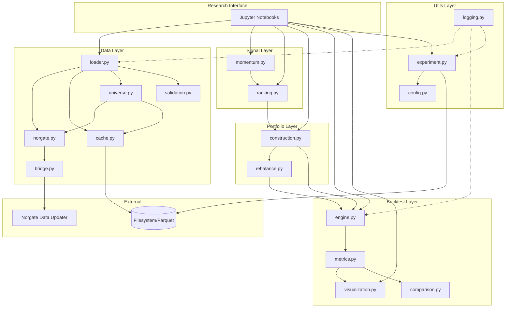

# Components

## Data Layer Components

### `src/data/bridge.py` - Windows Python Bridge

**Responsibility:** Execute Python code via Windows `python.exe` to communicate with Norgate Data Updater from WSL environment.

**Key Interfaces:**
```python
def execute_norgate_code(code: str) -> str
def fetch_json(code: str) -> dict | list
```

**Dependencies:** None (leaf component)

### `src/data/norgate.py` - Norgate API Wrapper

**Responsibility:** High-level interface to Norgate Data API, abstracting the bridge pattern.

**Key Interfaces:**
```python
def get_price_data(symbol: str, start_date: date, end_date: date,
                   adjustment: Adjustment = Adjustment.TOTALRETURN) -> pd.DataFrame
def get_watchlist_symbols(watchlist: str) -> list[str]
def get_index_constituents(symbol: str, index: str,
                           start_date: date, end_date: date) -> pd.DataFrame
def get_status() -> bool
```

**Dependencies:** `bridge.py`

### `src/data/cache.py` - Parquet Cache Manager

**Responsibility:** Cache Norgate data to local Parquet files for offline operation and fast iteration.

**Key Interfaces:**
```python
def save_prices(df: pd.DataFrame, universe: str) -> Path
def load_prices(universe: str) -> pd.DataFrame | None
def save_constituents(df: pd.DataFrame, index: str) -> Path
def load_constituents(index: str) -> pd.DataFrame | None
def invalidate(universe: str) -> None
def get_cache_info() -> dict[str, CacheMetadata]
```

**Dependencies:** None (uses filesystem)

### `src/data/loader.py` - Data Loading Orchestrator

**Responsibility:** Coordinate fetching data from Norgate (via bridge) or cache, with validation.

**Key Interfaces:**
```python
def load_universe(universe: str, start_date: date, end_date: date,
                  force_refresh: bool = False) -> pd.DataFrame
def load_constituents(index: str, start_date: date, end_date: date,
                      force_refresh: bool = False) -> pd.DataFrame
def refresh_cache(universe: str, start_date: date, end_date: date) -> None
```

**Dependencies:** `norgate.py`, `cache.py`, `validation.py`

### `src/data/universe.py` - Point-in-Time Universe Construction

**Responsibility:** Construct investable universe at each rebalance date using point-in-time index constituents with minimum history filtering.

**Key Interfaces:**
```python
def get_point_in_time_universe(index_name: str, as_of_date: date,
                                min_history_months: int = 12,
                                force_refresh: bool = False) -> list[str]
def get_index_constituents_at_date(index_name: str, as_of_date: date) -> list[str]
def filter_minimum_history(symbols: list[str], min_months: int,
                           as_of_date: date) -> list[str]
def cache_universe_snapshot(symbols: list[str], index_name: str,
                            as_of_date: date, metadata: dict) -> Path
def load_universe_snapshot(index_name: str, as_of_date: date) -> list[str] | None
```

**Dependencies:** `norgate.py`, `cache.py`

### `src/data/validation.py` - Data Quality Checks

**Responsibility:** Validate data integrity, detect missing values, corporate actions, and data anomalies.

**Key Interfaces:**
```python
def validate_prices(df: pd.DataFrame) -> ValidationReport
def validate_constituents(df: pd.DataFrame) -> ValidationReport
def check_adjustments(df: pd.DataFrame) -> ValidationReport
```

**Dependencies:** None

## Signal Layer Components

### `src/signals/momentum.py` - Momentum Signal Calculator

**Responsibility:** Calculate cross-sectional momentum signals using configurable lookback periods.

**Key Interfaces:**
```python
def calculate_momentum(prices: pd.DataFrame,
                       lookback_months: int = 12,
                       skip_months: int = 1) -> pd.DataFrame
def calculate_returns(prices: pd.DataFrame, periods: int = 1) -> pd.DataFrame
```

**Dependencies:** None (pure function)

### `src/signals/ranking.py` - Cross-Sectional Ranking

**Responsibility:** Rank securities by signal values and select top/bottom groups.

**Key Interfaces:**
```python
def rank_cross_sectional(signals: pd.DataFrame) -> pd.DataFrame
def select_deciles(ranked: pd.DataFrame,
                   long_percentile: float = 0.9,
                   short_percentile: float = 0.1) -> pd.DataFrame
def select_quantiles(ranked: pd.DataFrame,
                     n_quantiles: int = 10,
                     long_quantile: int = 10,
                     short_quantile: int = 1) -> pd.DataFrame
```

**Dependencies:** None (pure function)

## Portfolio Layer Components

### `src/portfolio/construction.py` - Portfolio Weight Calculator

**Responsibility:** Convert selected securities into portfolio weights with exposure normalization.

**Key Interfaces:**
```python
def equal_weight_portfolio(selections: pd.DataFrame,
                           long_exposure: float = 1.0,
                           short_exposure: float = 1.0) -> pd.DataFrame
def validate_weights(weights: pd.DataFrame) -> ValidationReport
```

**Dependencies:** None (pure function)

### `src/portfolio/rebalance.py` - Rebalancing Logic

**Responsibility:** Manage rebalancing schedule and calculate turnover.

**Key Interfaces:**
```python
def get_rebalance_dates(start_date: date, end_date: date,
                        frequency: str = "monthly") -> list[date]
def calculate_turnover(old_weights: pd.DataFrame,
                       new_weights: pd.DataFrame) -> float
```

**Dependencies:** None (pure function)

## Backtest Layer Components

### `src/backtest/engine.py` - Return Calculation Engine

**Responsibility:** Calculate portfolio returns from weights and price data. Manage overlapping portfolio state for K-month holding periods.

**Key Interfaces:**
```python
def run_backtest(weights: pd.DataFrame,
                 prices: pd.DataFrame,
                 config: StrategyConfig) -> BacktestResults
def run_backtest_with_overlapping(signal_generator: Callable,
                                   portfolio_constructor: Callable,
                                   prices: pd.DataFrame,
                                   config: StrategyConfig) -> BacktestResults
def calculate_period_return(weights: pd.DataFrame,
                            returns: pd.DataFrame,
                            period_start: date,
                            period_end: date) -> float
def _average_subportfolios(active_subportfolios: dict[date, pd.DataFrame]) -> pd.DataFrame
def _prune_expired_subportfolios(active: dict[date, pd.DataFrame],
                                 current_date: date,
                                 holding_months: int) -> dict[date, pd.DataFrame]
```

**Dependencies:** `src/portfolio/rebalance.py`

### `src/backtest/metrics.py` - Performance Metrics

**Responsibility:** Calculate summary statistics from backtest results.

**Key Interfaces:**
```python
def calculate_cagr(cumulative_values: pd.Series) -> float
def calculate_volatility(returns: pd.Series, annualize: bool = True) -> float
def calculate_sharpe_ratio(returns: pd.Series, risk_free_rate: float = 0.0) -> float
def calculate_max_drawdown(cumulative_values: pd.Series) -> tuple[float, date, date]
def calculate_summary(results: BacktestResults) -> PerformanceMetrics
```

**Dependencies:** None (pure functions)

### `src/backtest/visualization.py` - Performance Charts

**Responsibility:** Generate publication-quality visualizations of backtest results.

**Key Interfaces:**
```python
def plot_equity_curve(results: BacktestResults, title: str = "Equity Curve",
                      save_path: Path | None = None) -> Figure
def plot_drawdown(results: BacktestResults, save_path: Path | None = None) -> Figure
def plot_monthly_returns(results: BacktestResults, save_path: Path | None = None) -> Figure
def plot_performance_summary(results: BacktestResults, metrics: PerformanceMetrics,
                             save_path: Path | None = None) -> Figure
```

**Dependencies:** None

### `src/backtest/comparison.py` - Multi-Strategy Comparison

**Responsibility:** Compare multiple backtest results side-by-side.

**Key Interfaces:**
```python
def compare_equity_curves(results: list[BacktestResults], labels: list[str],
                          save_path: Path | None = None) -> Figure
def compare_metrics_table(metrics: list[PerformanceMetrics], labels: list[str]) -> pd.DataFrame
def compare_drawdowns(results: list[BacktestResults], labels: list[str]) -> Figure
```

**Dependencies:** None

## Utils Layer Components

### `src/utils/config.py` - Configuration Management

**Responsibility:** Define and validate strategy configurations.

**Key Interfaces:**
```python
@dataclass
class StrategyConfig:
    lookback_months: int = 12
    skip_months: int = 1
    # ... other fields
    def validate(self) -> None

def load_config(path: Path) -> StrategyConfig
def save_config(config: StrategyConfig, path: Path) -> None
```

### `src/utils/experiment.py` - Experiment Tracking

**Responsibility:** Log and retrieve experiment metadata for reproducibility.

**Key Interfaces:**
```python
class ExperimentTracker:
    def log_experiment(self, config: StrategyConfig,
                       metrics: PerformanceMetrics, notes: str = "") -> str
    def load_experiment(self, experiment_id: str) -> ExperimentRecord
    def list_experiments(self, filter: dict | None = None) -> pd.DataFrame
    def compare_experiments(self, ids: list[str]) -> pd.DataFrame
```

### `src/utils/logging.py` - Structured Logging Setup

**Responsibility:** Configure structlog for consistent, AI-parseable logging.

**Key Interfaces:**
```python
def setup_logging(level: str = "INFO", json_output: bool = False) -> None
def get_logger(name: str) -> BoundLogger
```

### `src/utils/exceptions.py` - Custom Exceptions

**Responsibility:** Define exception hierarchy for clear error handling.

```python
class MomoError(Exception): ...
class DataError(MomoError): ...
class NDUNotAvailableError(DataError): ...
class BridgeError(DataError): ...
class CacheError(DataError): ...
class ValidationError(DataError): ...
class SignalError(MomoError): ...
class InsufficientDataError(SignalError): ...
class PortfolioError(MomoError): ...
class WeightConstraintError(PortfolioError): ...
class BacktestError(MomoError): ...
class ConfigurationError(BacktestError): ...
```

## Component Diagram



---
