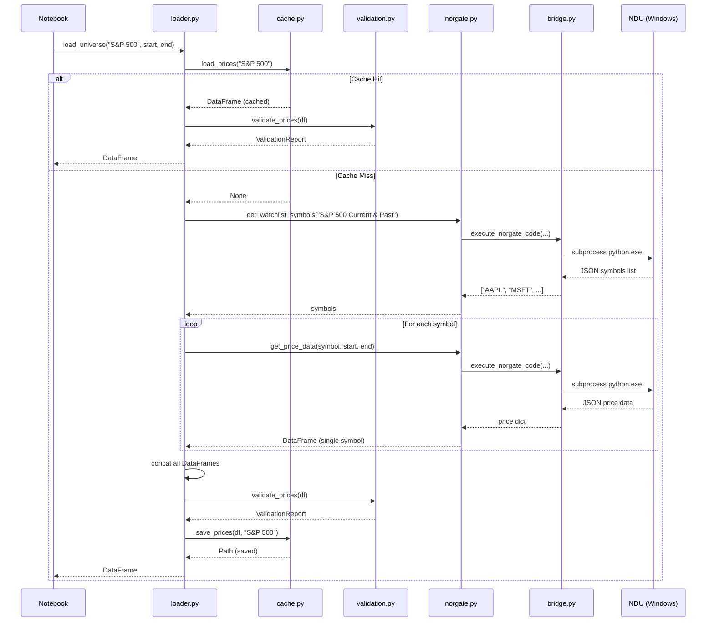
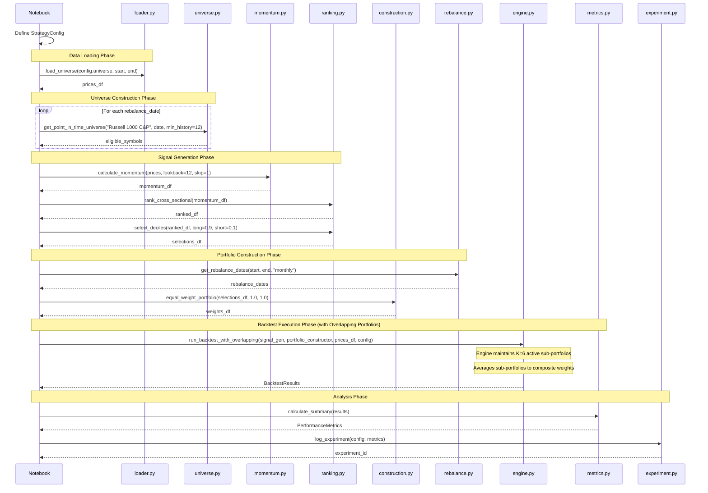
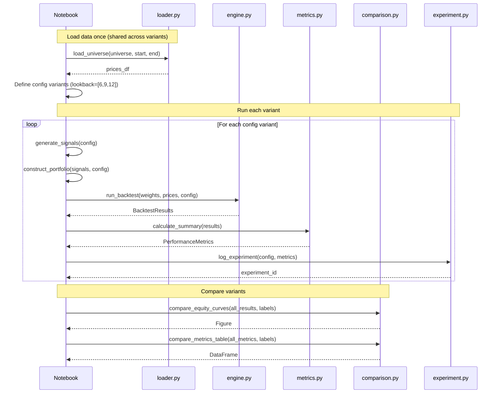

# Core Workflows

## Workflow 1: Data Loading with Cache

```mermaid
sequenceDiagram
    participant NB as Notebook
    participant LDR as loader.py
    participant CAC as cache.py
    participant VAL as validation.py
    participant NOR as norgate.py
    participant BRG as bridge.py
    participant NDU as NDU (Windows)

    NB->>LDR: load_universe("S&P 500", start, end)
    LDR->>CAC: load_prices("S&P 500")

    alt Cache Hit
        CAC-->>LDR: DataFrame (cached)
        LDR->>VAL: validate_prices(df)
        VAL-->>LDR: ValidationReport
        LDR-->>NB: DataFrame
    else Cache Miss
        CAC-->>LDR: None
        LDR->>NOR: get_watchlist_symbols("S&P 500 Current & Past")
        NOR->>BRG: execute_norgate_code(...)
        BRG->>NDU: subprocess python.exe
        NDU-->>BRG: JSON symbols list
        BRG-->>NOR: ["AAPL", "MSFT", ...]
        NOR-->>LDR: symbols

        loop For each symbol
            LDR->>NOR: get_price_data(symbol, start, end)
            NOR->>BRG: execute_norgate_code(...)
            BRG->>NDU: subprocess python.exe
            NDU-->>BRG: JSON price data
            BRG-->>NOR: price dict
            NOR-->>LDR: DataFrame (single symbol)
        end

        LDR->>LDR: concat all DataFrames
        LDR->>VAL: validate_prices(df)
        VAL-->>LDR: ValidationReport
        LDR->>CAC: save_prices(df, "S&P 500")
        CAC-->>LDR: Path (saved)
        LDR-->>NB: DataFrame
    end
```

## Workflow 2: Full Backtest Execution

```mermaid
sequenceDiagram
    participant NB as Notebook
    participant LDR as loader.py
    participant UNI as universe.py
    participant MOM as momentum.py
    participant RNK as ranking.py
    participant CON as construction.py
    participant REB as rebalance.py
    participant ENG as engine.py
    participant MET as metrics.py
    participant EXP as experiment.py

    NB->>NB: Define StrategyConfig

    Note over NB,LDR: Data Loading Phase
    NB->>LDR: load_universe(config.universe, start, end)
    LDR-->>NB: prices_df

    Note over NB,UNI: Universe Construction Phase
    loop For each rebalance_date
        NB->>UNI: get_point_in_time_universe("Russell 1000 C&P", date, min_history=12)
        UNI-->>NB: eligible_symbols
    end

    Note over NB,RNK: Signal Generation Phase
    NB->>MOM: calculate_momentum(prices, lookback=12, skip=1)
    MOM-->>NB: momentum_df
    NB->>RNK: rank_cross_sectional(momentum_df)
    RNK-->>NB: ranked_df
    NB->>RNK: select_deciles(ranked_df, long=0.9, short=0.1)
    RNK-->>NB: selections_df

    Note over NB,REB: Portfolio Construction Phase
    NB->>REB: get_rebalance_dates(start, end, "monthly")
    REB-->>NB: rebalance_dates
    NB->>CON: equal_weight_portfolio(selections_df, 1.0, 1.0)
    CON-->>NB: weights_df

    Note over NB,MET: Backtest Execution Phase (with Overlapping Portfolios)
    NB->>ENG: run_backtest_with_overlapping(signal_gen, portfolio_constructor, prices_df, config)
    Note over ENG: Engine maintains K=6 active sub-portfolios
    Note over ENG: Averages sub-portfolios to composite weights
    ENG-->>NB: BacktestResults

    Note over NB,EXP: Analysis Phase
    NB->>MET: calculate_summary(results)
    MET-->>NB: PerformanceMetrics
    NB->>EXP: log_experiment(config, metrics)
    EXP-->>NB: experiment_id
```

## Workflow 3: Parameter Sweep Comparison

```mermaid
sequenceDiagram
    participant NB as Notebook
    participant LDR as loader.py
    participant ENG as engine.py
    participant MET as metrics.py
    participant CMP as comparison.py
    participant EXP as experiment.py

    Note over NB,LDR: Load data once (shared across variants)
    NB->>LDR: load_universe(universe, start, end)
    LDR-->>NB: prices_df

    NB->>NB: Define config variants (lookback=[6,9,12])

    Note over NB,EXP: Run each variant
    loop For each config variant
        NB->>NB: generate_signals(config)
        NB->>NB: construct_portfolio(signals, config)
        NB->>ENG: run_backtest(weights, prices, config)
        ENG-->>NB: BacktestResults
        NB->>MET: calculate_summary(results)
        MET-->>NB: PerformanceMetrics
        NB->>EXP: log_experiment(config, metrics)
        EXP-->>NB: experiment_id
    end

    Note over NB,CMP: Compare variants
    NB->>CMP: compare_equity_curves(all_results, labels)
    CMP-->>NB: Figure
    NB->>CMP: compare_metrics_table(all_metrics, labels)
    CMP-->>NB: DataFrame
```

---
