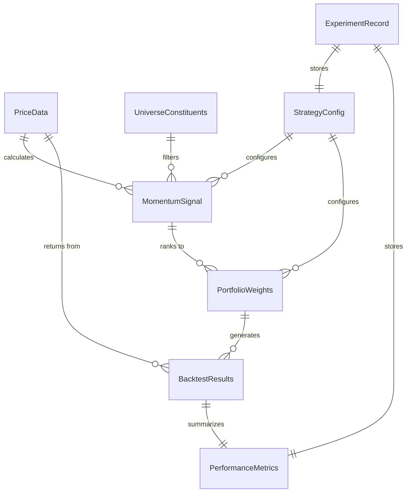

# Data Models

This section defines the core data structures that flow through the system. Given the functional pipeline architecture, these are primarily **pandas DataFrames with specific schemas** rather than ORM entities.

## Price Data

**Purpose:** Raw and adjusted OHLCV data from Norgate, cached to Parquet.

| Attribute | Type | Description |
|-----------|------|-------------|
| `date` | `datetime64[ns]` | Trading date (DataFrame index) |
| `symbol` | `str` | Ticker symbol (e.g., "AAPL", "LEHMQ-201203") |
| `open` | `float64` | Opening price (adjusted) |
| `high` | `float64` | High price (adjusted) |
| `low` | `float64` | Low price (adjusted) |
| `close` | `float64` | Closing price (adjusted) |
| `volume` | `int64` | Trading volume |
| `unadjusted_close` | `float64` | Raw close for reference |
| `dividend` | `float64` | Dividend amount (for TOTALRETURN adjustment) |

**DataFrame Format:** MultiIndex `(date, symbol)` or wide format `date` index with symbol columns depending on operation.

## Universe Constituents

**Purpose:** Point-in-time index membership for survivorship-bias-free backtesting.

| Attribute | Type | Description |
|-----------|------|-------------|
| `date` | `datetime64[ns]` | Trading date (DataFrame index) |
| `symbol` | `str` | Ticker symbol |
| `index_name` | `str` | Index identifier (e.g., "S&P 500", "Russell 1000") |
| `is_member` | `bool` | True if symbol was index member on date |

## Momentum Signal

**Purpose:** Calculated momentum values for ranking and selection.

| Attribute | Type | Description |
|-----------|------|-------------|
| `date` | `datetime64[ns]` | Signal calculation date (month-end) |
| `symbol` | `str` | Ticker symbol |
| `momentum` | `float64` | Raw momentum value (cumulative return t-12 to t-2) |
| `rank` | `float64` | Cross-sectional percentile rank (0.0 to 1.0) |
| `decile` | `int8` | Decile bucket (1-10, where 10 = highest momentum) |

## Portfolio Weights

**Purpose:** Target portfolio positions at each rebalance date.

| Attribute | Type | Description |
|-----------|------|-------------|
| `date` | `datetime64[ns]` | Rebalance date |
| `symbol` | `str` | Ticker symbol |
| `weight` | `float64` | Position weight (-1.0 to 1.0, negative = short) |
| `side` | `str` | "long" or "short" |

**Constraints:**
- `sum(long_weights) ≈ 1.0`
- `sum(short_weights) ≈ -1.0`
- `sum(all_weights) ≈ 0.0` (market neutral)

## Backtest Results

**Purpose:** Performance output from backtest engine.

| Attribute | Type | Description |
|-----------|------|-------------|
| `date` | `datetime64[ns]` | Period date |
| `portfolio_return` | `float64` | Period return (e.g., monthly) |
| `cumulative_value` | `float64` | Cumulative portfolio value (starting at 1.0) |
| `drawdown` | `float64` | Current drawdown from peak (0.0 to -1.0) |
| `long_count` | `int32` | Number of long positions |
| `short_count` | `int32` | Number of short positions |
| `turnover` | `float64` | Period turnover (0.0 to 2.0) |

## Performance Metrics

**Purpose:** Summary statistics for strategy evaluation.

| Attribute | Type | Description |
|-----------|------|-------------|
| `cagr` | `float64` | Compound annual growth rate |
| `volatility` | `float64` | Annualized standard deviation |
| `sharpe_ratio` | `float64` | Risk-adjusted return (rf=0 default) |
| `max_drawdown` | `float64` | Maximum peak-to-trough decline |
| `avg_turnover` | `float64` | Average monthly turnover |
| `total_periods` | `int32` | Number of periods in backtest |
| `start_date` | `datetime64[ns]` | Backtest start date |
| `end_date` | `datetime64[ns]` | Backtest end date |

## Strategy Configuration

**Purpose:** Parameters defining a strategy variant for backtesting.

| Attribute | Type | Description |
|-----------|------|-------------|
| `lookback_months` | `int` | Momentum lookback period (default: 12) |
| `skip_months` | `int` | Recent months to skip (default: 1) |
| `holding_months` | `int` | Overlapping portfolio holding period K (default: 6) |
| `selection_method` | `str` | "decile", "quintile", "tertile" |
| `long_percentile` | `float` | Top percentile for longs (default: 0.9) |
| `short_percentile` | `float` | Bottom percentile for shorts (default: 0.1) |
| `rebalance_frequency` | `str` | "monthly", "quarterly" |
| `universe` | `str` | Index name for universe (default: "Russell 1000 Current & Past") |
| `min_history_months` | `int` | Minimum price history required for universe inclusion (default: 12) |
| `start_date` | `date` | Backtest start |
| `end_date` | `date` | Backtest end |
| `long_exposure` | `float` | Target long exposure (default: 1.0) |
| `short_exposure` | `float` | Target short exposure (default: 1.0) |

## Experiment Record

**Purpose:** Metadata tracking for reproducibility and comparison.

| Attribute | Type | Description |
|-----------|------|-------------|
| `experiment_id` | `str` | Unique identifier (timestamp-based) |
| `created_at` | `datetime` | When experiment was run |
| `config` | `StrategyConfig` | Full strategy configuration |
| `metrics` | `PerformanceMetrics` | Summary results |
| `notes` | `str` | User annotations |
| `git_hash` | `str` | Code version (optional) |

## Data Model Diagram

---
