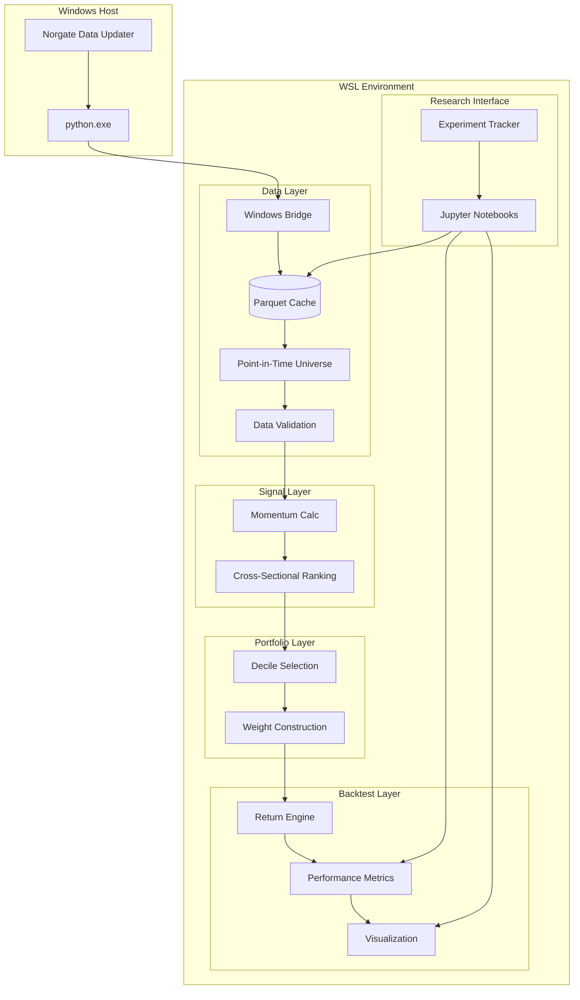

# High Level Architecture

## Technical Summary

The portfolio-momentum framework is a **monolithic Python package** with a layered internal architecture following a functional data pipeline pattern. The system transforms raw market data from Norgate into actionable momentum signals and backtest results through five discrete layers: Data → Signal → Portfolio → Backtest → Risk. Pure functions ensure reproducibility, while Parquet caching enables offline operation and fast iteration. A Windows Python bridge pattern handles the WSL-to-NDU communication constraint, with all analysis performed in the native WSL Python environment.

## High Level Overview

| Decision | Choice | Rationale |
|----------|--------|-----------|
| **Architectural Style** | Monolithic Python Package | Appropriate for batch computations on a single machine; avoids distributed systems complexity for a personal research tool |
| **Repository Structure** | Monorepo | Single repository keeps all layers together for easier development; version consistency across components |
| **Service Architecture** | Layered/Pipeline | Clear separation: Data → Signal → Portfolio → Backtest → Risk with well-defined interfaces |
| **Primary Data Flow** | Norgate API → Windows Bridge → Parquet Cache → Universe Construction → pandas DataFrames → Signals → Weights (K sub-portfolios) → Composite Weights → Returns → Metrics |
| **Interaction Model** | Jupyter notebooks + Python scripts | Code-first research environment per PRD requirements |

## High Level Project Diagram

## Architectural and Design Patterns

| Pattern | Description | Rationale |
|---------|-------------|-----------|
| **Layered Architecture** | Five discrete layers (Data/Signal/Portfolio/Backtest/Risk) with unidirectional dependencies | Enables independent testing; supports separation of concerns; allows swapping implementations |
| **Functional Pipeline** | Pure functions transform data through stages; no side effects in signal/portfolio calculations | Ensures reproducibility; deterministic results for backtesting integrity |
| **Repository/Cache Pattern** | Data layer abstracts Norgate API behind caching interface | Supports offline operation; enables fast iteration without API calls |
| **Point-in-Time Universe** | Universe construction filters eligible securities at each rebalance date with minimum history requirements | Eliminates survivorship and look-ahead bias; matches academic methodology (J&T 1993) |
| **Overlapping Portfolios** | Backtest engine maintains K active sub-portfolios, averages to produce composite weights | Reduces turnover from 100% to ~17% monthly (K=6); critical for transaction cost realism |
| **Strategy Pattern** | Signal calculators and portfolio constructors as interchangeable components | Supports extensibility; new momentum variants without core changes |
| **Bridge Pattern** | Windows Python subprocess handles cross-environment IPC | Required constraint from Norgate exploration; clean separation of concerns |
| **Configuration as Data** | Strategy parameters as Python dataclasses/dicts, not code | Supports parameter modification; enables parameter sweeps |

---
