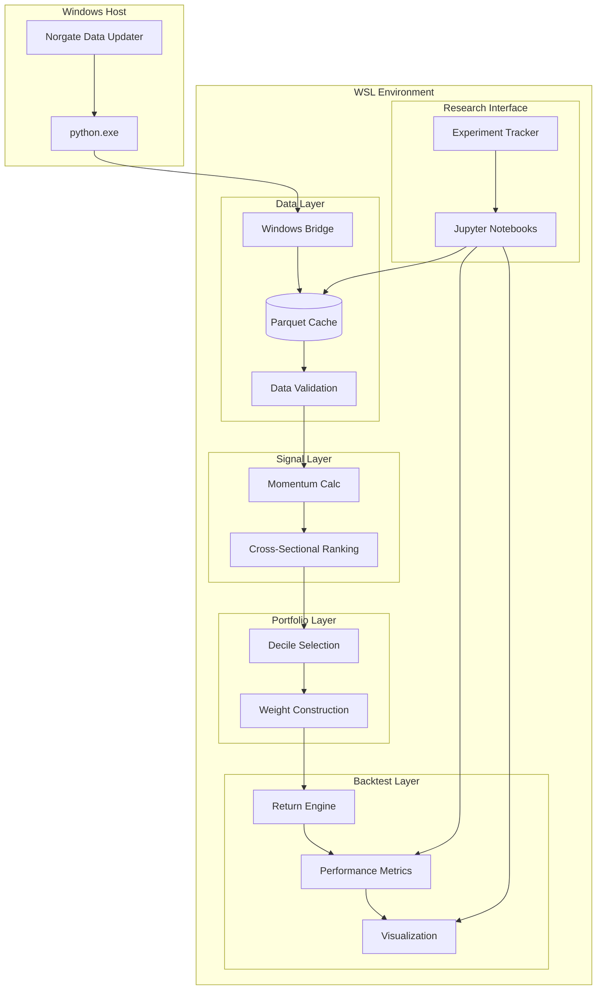
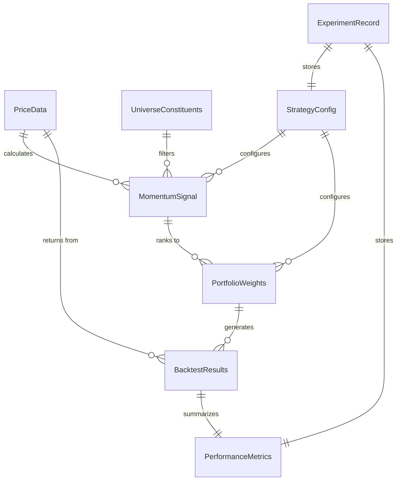
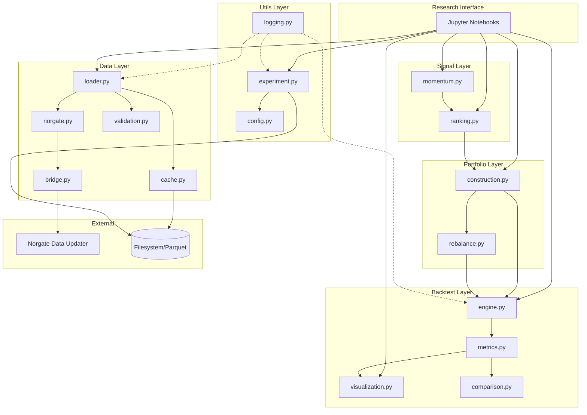
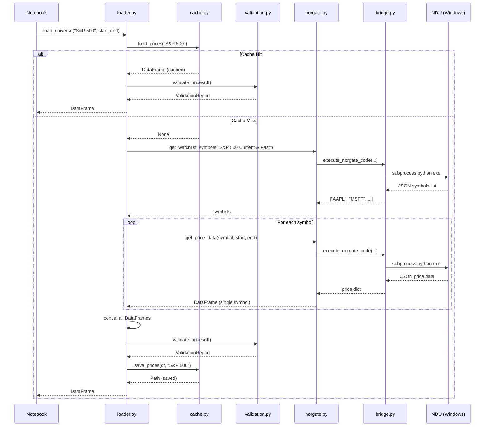
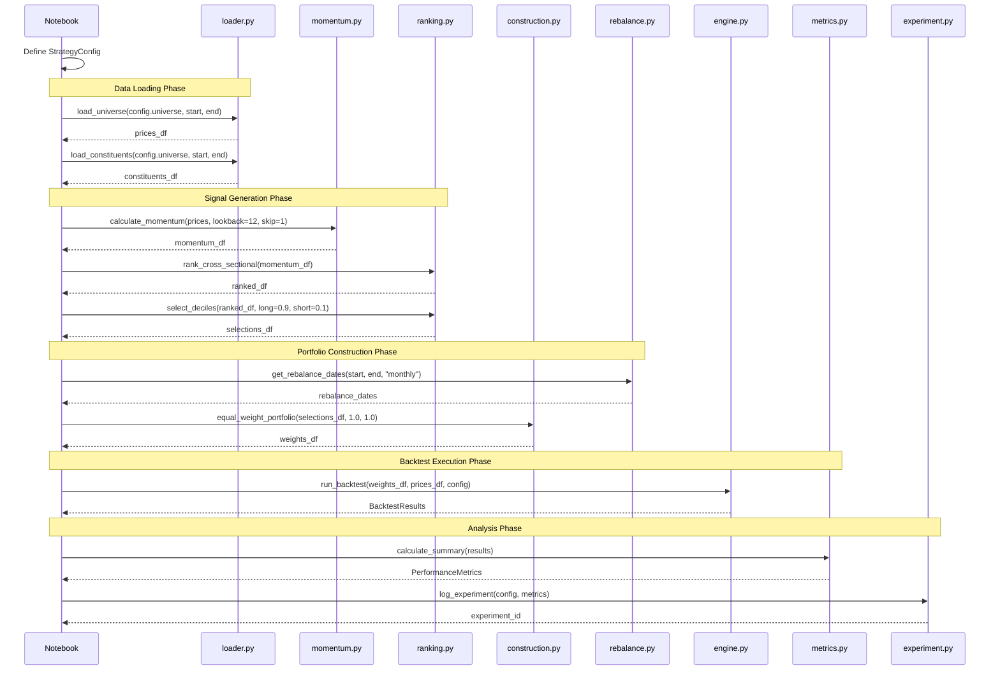
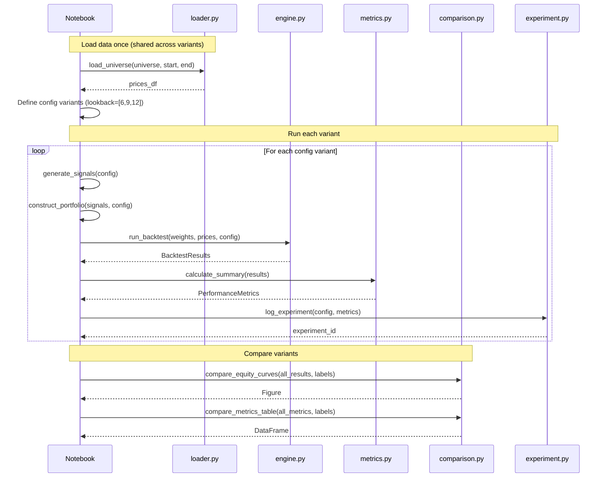

# Portfolio-Momentum Architecture Document

## Introduction

This document outlines the overall project architecture for portfolio-momentum (momo), a quantitative momentum research framework. It serves as the guiding architectural blueprint for AI-driven development, ensuring consistency and adherence to chosen patterns and technologies.

**Relationship to Frontend Architecture:**
This project does not include a frontend user interface. The primary interface is Jupyter notebooks for interactive research. No separate Frontend Architecture Document is required.

### Starter Template or Existing Project

**Status:** Greenfield project - no starter template

This is a new quantitative research framework being built from scratch. The PRD explicitly states this is a personal research tool with a custom-built backtest engine (not using external frameworks like zipline or backtrader). The specialized nature of this project (momentum strategy research with Norgate Data integration) doesn't align well with existing boilerplate projects.

### Change Log

| Date | Version | Description | Author |
|------|---------|-------------|--------|
| 2025-01-28 | 1.0 | Initial architecture document | Winston (Architect) |

---

## High Level Architecture

### Technical Summary

The portfolio-momentum framework is a **monolithic Python package** with a layered internal architecture following a functional data pipeline pattern. The system transforms raw market data from Norgate into actionable momentum signals and backtest results through five discrete layers: Data → Signal → Portfolio → Backtest → Risk. Pure functions ensure reproducibility, while Parquet caching enables offline operation and fast iteration. A Windows Python bridge pattern handles the WSL-to-NDU communication constraint, with all analysis performed in the native WSL Python environment.

### High Level Overview

| Decision | Choice | Rationale |
|----------|--------|-----------|
| **Architectural Style** | Monolithic Python Package | Appropriate for batch computations on a single machine; avoids distributed systems complexity for a personal research tool |
| **Repository Structure** | Monorepo | Single repository keeps all layers together for easier development; version consistency across components |
| **Service Architecture** | Layered/Pipeline | Clear separation: Data → Signal → Portfolio → Backtest → Risk with well-defined interfaces |
| **Primary Data Flow** | Norgate API → Windows Bridge → Parquet Cache → pandas DataFrames → Signals → Weights → Returns → Metrics |
| **Interaction Model** | Jupyter notebooks + Python scripts | Code-first research environment per PRD requirements |

### High Level Project Diagram



### Architectural and Design Patterns

| Pattern | Description | Rationale |
|---------|-------------|-----------|
| **Layered Architecture** | Five discrete layers (Data/Signal/Portfolio/Backtest/Risk) with unidirectional dependencies | Enables independent testing; supports separation of concerns; allows swapping implementations |
| **Functional Pipeline** | Pure functions transform data through stages; no side effects in signal/portfolio calculations | Ensures reproducibility; deterministic results for backtesting integrity |
| **Repository/Cache Pattern** | Data layer abstracts Norgate API behind caching interface | Supports offline operation; enables fast iteration without API calls |
| **Strategy Pattern** | Signal calculators and portfolio constructors as interchangeable components | Supports extensibility; new momentum variants without core changes |
| **Bridge Pattern** | Windows Python subprocess handles cross-environment IPC | Required constraint from Norgate exploration; clean separation of concerns |
| **Configuration as Data** | Strategy parameters as Python dataclasses/dicts, not code | Supports parameter modification; enables parameter sweeps |

---

## Tech Stack

This section defines the **definitive technology choices** for the project. All other documents and implementation must reference these selections.

### Cloud Infrastructure

| Item | Value |
|------|-------|
| **Provider** | Local (WSL2 on Windows) |
| **Deployment Target** | Personal development machine |
| **Future Consideration** | AWS/GCP for paper trading phase (post-MVP) |

### Technology Stack Table

| Category | Technology | Version | Purpose | Rationale |
|----------|------------|---------|---------|-----------|
| **Language** | Python | 3.13 | Primary development language | Modern Python with full type hints; already initialized per git history |
| **Runtime** | CPython | 3.13 | Python interpreter | Standard interpreter; best ecosystem compatibility |
| **Package Manager** | uv (Astral) | 0.5+ | Dependency management | Fast, reliable; already initialized per PRD; replaces pip/poetry |
| **Data Processing** | pandas | 2.2.x | DataFrame operations, time series | Industry standard for financial data; vectorized operations |
| **Data Processing** | numpy | 2.1.x | Numerical computations | Foundation for pandas; required for vectorized calculations |
| **Data Processing** | pyarrow | 18.x | Parquet read/write | Required for pandas Parquet support; fast columnar storage |
| **Statistics** | scipy | 1.14.x | Statistical functions | Performance metrics, distributions |
| **Statistics** | statsmodels | 0.14.x | Time series analysis | Regression, statistical tests for validation |
| **Data Source** | norgatedata | 1.0.74 | Norgate Data API | Required for market data access; Windows-only via bridge |
| **Visualization** | matplotlib | 3.9.x | Static charts, equity curves | Publication-quality figures; Jupyter integration |
| **Visualization** | seaborn | 0.13.x | Statistical visualizations | Better defaults than matplotlib; heatmaps |
| **Interactive** | jupyter | 4.x | Research notebooks | Primary research interface per PRD |
| **Interactive** | jupyterlab | 4.x | Enhanced notebook IDE | Better UX than classic notebook |
| **Testing** | pytest | 8.x | Test framework | Industry standard; fixtures, parametrize |
| **Testing** | pytest-cov | 5.x | Coverage reporting | Track test coverage on critical paths |
| **Testing** | pytest-xdist | 3.5.x | Parallel test execution | Fast test runs across CPU cores; critical for parameter sweep validation |
| **Linting** | ruff | 0.7.x | Linting + formatting | Fast, replaces flake8/black/isort |
| **Type Checking** | mypy | 1.13.x | Static type analysis (strict mode) | Quant accuracy requires precise types; catch numeric/DataFrame errors early |
| **Logging** | structlog | 24.x | Structured logging | JSON-formatted logs for AI agent troubleshooting; context preservation across pipeline stages |
| **Retry Logic** | tenacity | 9.x | Retry with backoff | Resilient Norgate API calls via bridge |

---

## Data Models

This section defines the core data structures that flow through the system. Given the functional pipeline architecture, these are primarily **pandas DataFrames with specific schemas** rather than ORM entities.

### Price Data

**Purpose:** Raw and adjusted OHLCV data from Norgate, cached to Parquet.

| Attribute | Type | Description |
|-----------|------|-------------|
| `date` | `datetime64[ns]` | Trading date (DataFrame index) |
| `symbol` | `str` | Ticker symbol (e.g., "AAPL", "LEHMQ-201203") |
| `open` | `float64` | Opening price (adjusted) |
| `high` | `float64` | High price (adjusted) |
| `low` | `float64` | Low price (adjusted) |
| `close` | `float64` | Closing price (adjusted) |
| `volume` | `int64` | Trading volume |
| `unadjusted_close` | `float64` | Raw close for reference |
| `dividend` | `float64` | Dividend amount (for TOTALRETURN adjustment) |

**DataFrame Format:** MultiIndex `(date, symbol)` or wide format `date` index with symbol columns depending on operation.

### Universe Constituents

**Purpose:** Point-in-time index membership for survivorship-bias-free backtesting.

| Attribute | Type | Description |
|-----------|------|-------------|
| `date` | `datetime64[ns]` | Trading date (DataFrame index) |
| `symbol` | `str` | Ticker symbol |
| `index_name` | `str` | Index identifier (e.g., "S&P 500", "Russell 1000") |
| `is_member` | `bool` | True if symbol was index member on date |

### Momentum Signal

**Purpose:** Calculated momentum values for ranking and selection.

| Attribute | Type | Description |
|-----------|------|-------------|
| `date` | `datetime64[ns]` | Signal calculation date (month-end) |
| `symbol` | `str` | Ticker symbol |
| `momentum` | `float64` | Raw momentum value (cumulative return t-12 to t-2) |
| `rank` | `float64` | Cross-sectional percentile rank (0.0 to 1.0) |
| `decile` | `int8` | Decile bucket (1-10, where 10 = highest momentum) |

### Portfolio Weights

**Purpose:** Target portfolio positions at each rebalance date.

| Attribute | Type | Description |
|-----------|------|-------------|
| `date` | `datetime64[ns]` | Rebalance date |
| `symbol` | `str` | Ticker symbol |
| `weight` | `float64` | Position weight (-1.0 to 1.0, negative = short) |
| `side` | `str` | "long" or "short" |

**Constraints:**
- `sum(long_weights) ≈ 1.0`
- `sum(short_weights) ≈ -1.0`
- `sum(all_weights) ≈ 0.0` (market neutral)

### Backtest Results

**Purpose:** Performance output from backtest engine.

| Attribute | Type | Description |
|-----------|------|-------------|
| `date` | `datetime64[ns]` | Period date |
| `portfolio_return` | `float64` | Period return (e.g., monthly) |
| `cumulative_value` | `float64` | Cumulative portfolio value (starting at 1.0) |
| `drawdown` | `float64` | Current drawdown from peak (0.0 to -1.0) |
| `long_count` | `int32` | Number of long positions |
| `short_count` | `int32` | Number of short positions |
| `turnover` | `float64` | Period turnover (0.0 to 2.0) |

### Performance Metrics

**Purpose:** Summary statistics for strategy evaluation.

| Attribute | Type | Description |
|-----------|------|-------------|
| `cagr` | `float64` | Compound annual growth rate |
| `volatility` | `float64` | Annualized standard deviation |
| `sharpe_ratio` | `float64` | Risk-adjusted return (rf=0 default) |
| `max_drawdown` | `float64` | Maximum peak-to-trough decline |
| `avg_turnover` | `float64` | Average monthly turnover |
| `total_periods` | `int32` | Number of periods in backtest |
| `start_date` | `datetime64[ns]` | Backtest start date |
| `end_date` | `datetime64[ns]` | Backtest end date |

### Strategy Configuration

**Purpose:** Parameters defining a strategy variant for backtesting.

| Attribute | Type | Description |
|-----------|------|-------------|
| `lookback_months` | `int` | Momentum lookback period (default: 12) |
| `skip_months` | `int` | Recent months to skip (default: 1) |
| `selection_method` | `str` | "decile", "quintile", "tertile" |
| `long_percentile` | `float` | Top percentile for longs (default: 0.9) |
| `short_percentile` | `float` | Bottom percentile for shorts (default: 0.1) |
| `rebalance_frequency` | `str` | "monthly", "quarterly" |
| `universe` | `str` | Index name for universe (e.g., "S&P 500") |
| `start_date` | `date` | Backtest start |
| `end_date` | `date` | Backtest end |
| `long_exposure` | `float` | Target long exposure (default: 1.0) |
| `short_exposure` | `float` | Target short exposure (default: 1.0) |

### Experiment Record

**Purpose:** Metadata tracking for reproducibility and comparison.

| Attribute | Type | Description |
|-----------|------|-------------|
| `experiment_id` | `str` | Unique identifier (timestamp-based) |
| `created_at` | `datetime` | When experiment was run |
| `config` | `StrategyConfig` | Full strategy configuration |
| `metrics` | `PerformanceMetrics` | Summary results |
| `notes` | `str` | User annotations |
| `git_hash` | `str` | Code version (optional) |

### Data Model Diagram



---

## Components

### Data Layer Components

#### `src/data/bridge.py` - Windows Python Bridge

**Responsibility:** Execute Python code via Windows `python.exe` to communicate with Norgate Data Updater from WSL environment.

**Key Interfaces:**
```python
def execute_norgate_code(code: str) -> str
def fetch_json(code: str) -> dict | list
```

**Dependencies:** None (leaf component)

#### `src/data/norgate.py` - Norgate API Wrapper

**Responsibility:** High-level interface to Norgate Data API, abstracting the bridge pattern.

**Key Interfaces:**
```python
def get_price_data(symbol: str, start_date: date, end_date: date,
                   adjustment: Adjustment = Adjustment.TOTALRETURN) -> pd.DataFrame
def get_watchlist_symbols(watchlist: str) -> list[str]
def get_index_constituents(symbol: str, index: str,
                           start_date: date, end_date: date) -> pd.DataFrame
def get_status() -> bool
```

**Dependencies:** `bridge.py`

#### `src/data/cache.py` - Parquet Cache Manager

**Responsibility:** Cache Norgate data to local Parquet files for offline operation and fast iteration.

**Key Interfaces:**
```python
def save_prices(df: pd.DataFrame, universe: str) -> Path
def load_prices(universe: str) -> pd.DataFrame | None
def save_constituents(df: pd.DataFrame, index: str) -> Path
def load_constituents(index: str) -> pd.DataFrame | None
def invalidate(universe: str) -> None
def get_cache_info() -> dict[str, CacheMetadata]
```

**Dependencies:** None (uses filesystem)

#### `src/data/loader.py` - Data Loading Orchestrator

**Responsibility:** Coordinate fetching data from Norgate (via bridge) or cache, with validation.

**Key Interfaces:**
```python
def load_universe(universe: str, start_date: date, end_date: date,
                  force_refresh: bool = False) -> pd.DataFrame
def load_constituents(index: str, start_date: date, end_date: date,
                      force_refresh: bool = False) -> pd.DataFrame
def refresh_cache(universe: str, start_date: date, end_date: date) -> None
```

**Dependencies:** `norgate.py`, `cache.py`, `validation.py`

#### `src/data/validation.py` - Data Quality Checks

**Responsibility:** Validate data integrity, detect missing values, corporate actions, and data anomalies.

**Key Interfaces:**
```python
def validate_prices(df: pd.DataFrame) -> ValidationReport
def validate_constituents(df: pd.DataFrame) -> ValidationReport
def check_adjustments(df: pd.DataFrame) -> ValidationReport
```

**Dependencies:** None

### Signal Layer Components

#### `src/signals/momentum.py` - Momentum Signal Calculator

**Responsibility:** Calculate cross-sectional momentum signals using configurable lookback periods.

**Key Interfaces:**
```python
def calculate_momentum(prices: pd.DataFrame,
                       lookback_months: int = 12,
                       skip_months: int = 1) -> pd.DataFrame
def calculate_returns(prices: pd.DataFrame, periods: int = 1) -> pd.DataFrame
```

**Dependencies:** None (pure function)

#### `src/signals/ranking.py` - Cross-Sectional Ranking

**Responsibility:** Rank securities by signal values and select top/bottom groups.

**Key Interfaces:**
```python
def rank_cross_sectional(signals: pd.DataFrame) -> pd.DataFrame
def select_deciles(ranked: pd.DataFrame,
                   long_percentile: float = 0.9,
                   short_percentile: float = 0.1) -> pd.DataFrame
def select_quantiles(ranked: pd.DataFrame,
                     n_quantiles: int = 10,
                     long_quantile: int = 10,
                     short_quantile: int = 1) -> pd.DataFrame
```

**Dependencies:** None (pure function)

### Portfolio Layer Components

#### `src/portfolio/construction.py` - Portfolio Weight Calculator

**Responsibility:** Convert selected securities into portfolio weights with exposure normalization.

**Key Interfaces:**
```python
def equal_weight_portfolio(selections: pd.DataFrame,
                           long_exposure: float = 1.0,
                           short_exposure: float = 1.0) -> pd.DataFrame
def validate_weights(weights: pd.DataFrame) -> ValidationReport
```

**Dependencies:** None (pure function)

#### `src/portfolio/rebalance.py` - Rebalancing Logic

**Responsibility:** Manage rebalancing schedule and calculate turnover.

**Key Interfaces:**
```python
def get_rebalance_dates(start_date: date, end_date: date,
                        frequency: str = "monthly") -> list[date]
def calculate_turnover(old_weights: pd.DataFrame,
                       new_weights: pd.DataFrame) -> float
```

**Dependencies:** None (pure function)

### Backtest Layer Components

#### `src/backtest/engine.py` - Return Calculation Engine

**Responsibility:** Calculate portfolio returns from weights and price data.

**Key Interfaces:**
```python
def run_backtest(weights: pd.DataFrame,
                 prices: pd.DataFrame,
                 config: StrategyConfig) -> BacktestResults
def calculate_period_return(weights: pd.DataFrame,
                            returns: pd.DataFrame,
                            period_start: date,
                            period_end: date) -> float
```

**Dependencies:** `src/portfolio/rebalance.py`

#### `src/backtest/metrics.py` - Performance Metrics

**Responsibility:** Calculate summary statistics from backtest results.

**Key Interfaces:**
```python
def calculate_cagr(cumulative_values: pd.Series) -> float
def calculate_volatility(returns: pd.Series, annualize: bool = True) -> float
def calculate_sharpe_ratio(returns: pd.Series, risk_free_rate: float = 0.0) -> float
def calculate_max_drawdown(cumulative_values: pd.Series) -> tuple[float, date, date]
def calculate_summary(results: BacktestResults) -> PerformanceMetrics
```

**Dependencies:** None (pure functions)

#### `src/backtest/visualization.py` - Performance Charts

**Responsibility:** Generate publication-quality visualizations of backtest results.

**Key Interfaces:**
```python
def plot_equity_curve(results: BacktestResults, title: str = "Equity Curve",
                      save_path: Path | None = None) -> Figure
def plot_drawdown(results: BacktestResults, save_path: Path | None = None) -> Figure
def plot_monthly_returns(results: BacktestResults, save_path: Path | None = None) -> Figure
def plot_performance_summary(results: BacktestResults, metrics: PerformanceMetrics,
                             save_path: Path | None = None) -> Figure
```

**Dependencies:** None

#### `src/backtest/comparison.py` - Multi-Strategy Comparison

**Responsibility:** Compare multiple backtest results side-by-side.

**Key Interfaces:**
```python
def compare_equity_curves(results: list[BacktestResults], labels: list[str],
                          save_path: Path | None = None) -> Figure
def compare_metrics_table(metrics: list[PerformanceMetrics], labels: list[str]) -> pd.DataFrame
def compare_drawdowns(results: list[BacktestResults], labels: list[str]) -> Figure
```

**Dependencies:** None

### Utils Layer Components

#### `src/utils/config.py` - Configuration Management

**Responsibility:** Define and validate strategy configurations.

**Key Interfaces:**
```python
@dataclass
class StrategyConfig:
    lookback_months: int = 12
    skip_months: int = 1
    # ... other fields
    def validate(self) -> None

def load_config(path: Path) -> StrategyConfig
def save_config(config: StrategyConfig, path: Path) -> None
```

#### `src/utils/experiment.py` - Experiment Tracking

**Responsibility:** Log and retrieve experiment metadata for reproducibility.

**Key Interfaces:**
```python
class ExperimentTracker:
    def log_experiment(self, config: StrategyConfig,
                       metrics: PerformanceMetrics, notes: str = "") -> str
    def load_experiment(self, experiment_id: str) -> ExperimentRecord
    def list_experiments(self, filter: dict | None = None) -> pd.DataFrame
    def compare_experiments(self, ids: list[str]) -> pd.DataFrame
```

#### `src/utils/logging.py` - Structured Logging Setup

**Responsibility:** Configure structlog for consistent, AI-parseable logging.

**Key Interfaces:**
```python
def setup_logging(level: str = "INFO", json_output: bool = False) -> None
def get_logger(name: str) -> BoundLogger
```

#### `src/utils/exceptions.py` - Custom Exceptions

**Responsibility:** Define exception hierarchy for clear error handling.

```python
class MomoError(Exception): ...
class DataError(MomoError): ...
class NDUNotAvailableError(DataError): ...
class BridgeError(DataError): ...
class CacheError(DataError): ...
class ValidationError(DataError): ...
class SignalError(MomoError): ...
class InsufficientDataError(SignalError): ...
class PortfolioError(MomoError): ...
class WeightConstraintError(PortfolioError): ...
class BacktestError(MomoError): ...
class ConfigurationError(BacktestError): ...
```

### Component Diagram



---

## External APIs

### Norgate Data API

| Item | Value |
|------|-------|
| **Purpose** | Market data source - historical prices, index constituents, corporate actions |
| **Documentation** | https://norgatedata.com/python.php |
| **Base URL(s)** | Local IPC (Windows COM/pipe) - no network calls |
| **Authentication** | NDU desktop application must be running with valid subscription |
| **Rate Limits** | None (local API); ~7ms/symbol per exploration findings |

**Key Endpoints Used:**

| Function | Purpose |
|----------|---------|
| `norgatedata.price_timeseries(symbol, ...)` | Fetch OHLCV data with adjustment options |
| `norgatedata.watchlist_symbols(watchlist)` | Get symbols in a watchlist |
| `norgatedata.index_constituent_timeseries(symbol, index)` | Point-in-time index membership |
| `norgatedata.status()` | Check if NDU is running |

**Integration Notes:**
1. Windows-only constraint - use `python.exe` bridge from WSL
2. Use `StockPriceAdjustmentType.TOTALRETURN` for backtesting
3. Use `PaddingType.NONE` to avoid forward-filling delisted securities
4. Use `*Current & Past` watchlists for survivorship-bias-free universe
5. No historical market cap available - use index membership as size proxy

---

## Core Workflows

### Workflow 1: Data Loading with Cache



### Workflow 2: Full Backtest Execution



### Workflow 3: Parameter Sweep Comparison



---

## Database Schema

This project uses **Parquet files** as the primary storage layer.

### Storage Location

```
data/
├── cache/
│   ├── prices/
│   │   ├── sp500.parquet
│   │   └── russell1000.parquet
│   └── constituents/
│       ├── sp500_constituents.parquet
│       └── russell1000_constituents.parquet
└── results/
    └── experiments/
        └── 20250115_143022_abc123.json
```

### Price Data Schema (`cache/prices/*.parquet`)

| Column | Type | Description |
|--------|------|-------------|
| `date` | `datetime64[ns]` | Trading date |
| `symbol` | `string` | Ticker symbol |
| `open` | `float64` | Opening price (adjusted) |
| `high` | `float64` | High price (adjusted) |
| `low` | `float64` | Low price (adjusted) |
| `close` | `float64` | Closing price (adjusted) |
| `volume` | `int64` | Trading volume |
| `unadjusted_close` | `float64` | Raw closing price |
| `dividend` | `float64` | Dividend amount |

### Constituent Data Schema (`cache/constituents/*.parquet`)

| Column | Type | Description |
|--------|------|-------------|
| `date` | `datetime64[ns]` | Trading date |
| `symbol` | `string` | Ticker symbol |
| `index_name` | `string` | Index identifier |
| `is_member` | `bool` | True if member on this date |

### Experiment Record Schema (`results/experiments/*.json`)

```json
{
  "experiment_id": "20250115_143022_abc123",
  "created_at": "2025-01-15T14:30:22Z",
  "config": { ... },
  "metrics": { ... },
  "notes": "...",
  "git_hash": "a1b2c3d"
}
```

---

## Source Tree

```
momo/
├── .github/
│   └── workflows/
│       └── ci.yml                    # GitHub Actions CI pipeline
│
├── data/
│   ├── cache/
│   │   ├── prices/                   # Cached price Parquet files
│   │   └── constituents/             # Cached constituent Parquet files
│   └── results/
│       └── experiments/              # Experiment JSON records
│
├── docs/
│   ├── prd.md                        # Product Requirements Document
│   ├── architecture.md               # This document
│   ├── research/
│   │   └── norgate-api-exploration.md
│   └── stories/                      # User stories for development
│
├── notebooks/
│   ├── 01_data_exploration.ipynb     # Explore Norgate data
│   ├── 02_signal_development.ipynb   # Develop momentum signals
│   ├── 03_backtest_analysis.ipynb    # Run and analyze backtests
│   ├── 04_parameter_sweep.ipynb      # Compare strategy variants
│   └── scratch/                      # Temporary exploration notebooks
│
├── src/
│   └── momo/                         # Main package
│       ├── __init__.py
│       ├── py.typed                  # PEP 561 marker for type hints
│       │
│       ├── data/                     # Data Layer
│       │   ├── __init__.py
│       │   ├── bridge.py
│       │   ├── norgate.py
│       │   ├── cache.py
│       │   ├── loader.py
│       │   └── validation.py
│       │
│       ├── signals/                  # Signal Layer
│       │   ├── __init__.py
│       │   ├── momentum.py
│       │   └── ranking.py
│       │
│       ├── portfolio/                # Portfolio Layer
│       │   ├── __init__.py
│       │   ├── construction.py
│       │   └── rebalance.py
│       │
│       ├── backtest/                 # Backtest Layer
│       │   ├── __init__.py
│       │   ├── engine.py
│       │   ├── metrics.py
│       │   ├── visualization.py
│       │   └── comparison.py
│       │
│       └── utils/                    # Utils Layer
│           ├── __init__.py
│           ├── config.py
│           ├── experiment.py
│           ├── logging.py
│           ├── exceptions.py
│           └── types.py
│
├── tests/
│   ├── __init__.py
│   ├── conftest.py                   # Pytest fixtures
│   ├── unit/                         # Unit tests
│   │   ├── data/
│   │   ├── signals/
│   │   ├── portfolio/
│   │   ├── backtest/
│   │   └── utils/
│   ├── integration/                  # Integration tests
│   └── fixtures/                     # Test data files
│
├── scripts/
│   ├── refresh_cache.py
│   └── run_backtest.py
│
├── .gitignore
├── .python-version
├── pyproject.toml
├── uv.lock
├── ruff.toml
├── mypy.ini
├── pytest.ini
└── README.md
```

---

## Infrastructure and Deployment

### Infrastructure as Code

| Item | Value |
|------|-------|
| **Tool** | N/A (no cloud infrastructure) |
| **Approach** | Local-only for MVP |

### Deployment Strategy

| Item | Value |
|------|-------|
| **Strategy** | Local installation via `uv` |
| **CI/CD Platform** | GitHub Actions |
| **Pipeline Configuration** | `.github/workflows/ci.yml` |

### Environments

| Environment | Purpose |
|-------------|---------|
| **Development** | Local research (WSL2 + Windows for NDU) |
| **CI** | Automated testing on push/PR |

### CI Pipeline

```yaml
name: CI
on:
  push:
    branches: [main]
  pull_request:
    branches: [main]

jobs:
  test:
    runs-on: ubuntu-latest
    steps:
      - uses: actions/checkout@v4
      - uses: astral-sh/setup-uv@v4
      - run: uv python install 3.13
      - run: uv sync --all-extras
      - run: uv run ruff check src tests
      - run: uv run mypy src
      - run: uv run pytest -n auto --ignore=tests/integration -v
```

---

## Error Handling Strategy

### General Approach

| Item | Value |
|------|-------|
| **Error Model** | Exception-based with custom hierarchy |
| **Exception Hierarchy** | `MomoError` base class with layer-specific subclasses |
| **Error Propagation** | Fail fast at boundaries; let exceptions bubble up with context |

### Logging Standards

| Item | Value |
|------|-------|
| **Library** | structlog 24.x |
| **Format** | JSON (CI/scripts) / Console (interactive) |
| **Levels** | DEBUG, INFO, WARNING, ERROR, CRITICAL |

**Required Context:**
- `correlation_id` - UUID per operation
- `layer` - Component layer name
- `operation` - Current function/task
- `symbol` / `universe` - When applicable

### Error Handling Patterns

**External API Errors (Norgate Bridge):**
- 3 retry attempts with exponential backoff (1s, 2s, 4s)
- 30s timeout per symbol, 300s for full universe
- Bridge errors translated to `BridgeError` or `NDUNotAvailableError`

**Data Consistency:**
- Atomic file writes (tempfile + rename)
- Validation before caching
- Cache is idempotent (overwrite existing)

---

## Coding Standards

### Core Standards

| Item | Value |
|------|-------|
| **Language & Runtime** | Python 3.13 (strict type hints required) |
| **Style & Linting** | ruff |
| **Type Checking** | mypy strict mode |
| **Test Organization** | `tests/unit/{layer}/test_{module}.py` |

### Naming Conventions

| Element | Convention | Example |
|---------|------------|---------|
| DataFrame variables | Suffix `_df` | `prices_df` |
| Series variables | Suffix `_s` | `returns_s` |
| Date variables | Suffix `_date` | `start_date` |
| Config dataclasses | Suffix `Config` | `StrategyConfig` |
| Test fixtures | Prefix `sample_` | `sample_prices_df` |

### Critical Rules

1. **Pure Functions in Signal/Portfolio Layers** - No I/O, no mutation of inputs
2. **Always Use structlog** - Never `print()` or stdlib `logging`
3. **DataFrame Schema Documentation** - Document columns and dtypes in docstrings
4. **Explicit Date Handling** - Use `datetime.date`, not strings
5. **No Magic Numbers** - Name all constants or use config
6. **Validate at Layer Boundaries** - Data layer validates; inner layers trust input
7. **Test Naming** - `test_{function}_{scenario}`
8. **No Relative Imports Across Layers** - Use absolute imports from `momo`

---

## Test Strategy and Standards

### Testing Philosophy

| Item | Value |
|------|-------|
| **Approach** | TDD for core calculations; test-after for utilities |
| **Coverage Goals** | 90%+ for signal/portfolio/backtest; 70%+ overall |
| **Test Pyramid** | 70% unit, 25% integration, 5% e2e |

### Test Types

**Unit Tests:**
- Framework: pytest 8.x
- Location: `tests/unit/{layer}/`
- Coverage: 90% for core layers

**Integration Tests:**
- Location: `tests/integration/`
- Mock Norgate via bridge substitution

**E2E Tests:**
- Notebook execution via nbconvert
- Limited scope (no web UI)

### Test Data Management

- Pre-generated fixtures in `tests/fixtures/`
- Pytest fixtures in `conftest.py`
- Reproducible via `np.random.seed(42)`

---

## Security

### Security Context

| Aspect | Status |
|--------|--------|
| **Attack Surface** | Minimal - local tool |
| **User Authentication** | N/A |
| **Data Sensitivity** | Low |

### Key Security Measures

**Input Validation:**
- Validate Norgate data before caching
- Whitelist expected columns and dtypes

**Subprocess Security:**
- Never use `shell=True`
- Validate symbol format before bridge calls
- Never pass user input to subprocess

**Dependency Security:**
- Pin versions via `uv.lock`
- GitHub Dependabot for updates
- Review before adding new packages

### Security Checklist for AI Agents

- [ ] No `shell=True` in subprocess
- [ ] No `eval()` or `exec()` with external data
- [ ] No pickle for untrusted data
- [ ] Validated inputs at boundaries
- [ ] No sensitive data in logs

---

## Checklist Results Report

### Executive Summary

| Item | Value |
|------|-------|
| **Overall Architecture Readiness** | **HIGH** |
| **Project Type** | Backend-only (Python package) |
| **Critical Risks Identified** | 1 (Windows bridge is single point of failure - mitigated by cache fallback) |
| **Sections Evaluated** | 9 of 10 (Frontend sections skipped) |

**Key Strengths:**
1. Excellent alignment with PRD requirements - all functional requirements addressed
2. Clear layered architecture with well-defined component responsibilities
3. Strong AI agent implementation guidance with coding standards and patterns
4. Comprehensive test strategy with emphasis on reproducibility

### Section Pass Rates

| Section | Pass Rate | Notes |
|---------|-----------|-------|
| 1. Requirements Alignment | 95% | All FRs and NFRs covered |
| 2. Architecture Fundamentals | 100% | Excellent diagrams and component design |
| 3. Technical Stack | 92% | Versions specified, minor alternatives gap |
| 4. Frontend | SKIPPED | Backend-only project |
| 5. Resilience & Operations | 85% | Appropriate for local tool |
| 6. Security & Compliance | 90% | Subprocess security addressed |
| 7. Implementation Guidance | 95% | Comprehensive coding standards |
| 8. Dependencies | 95% | Well-documented integrations |
| 9. AI Agent Suitability | 100% | Exceptional clarity for AI implementation |
| 10. Accessibility | SKIPPED | No frontend |

### Top Risks

| Risk | Severity | Mitigation |
|------|----------|------------|
| Windows Bridge SPOF | Medium | Cache fallback enables offline operation |
| Norgate API Changes | Low | Bridge pattern isolates API |
| Large Universe Performance | Low | Parquet caching, vectorization |

### Recommendations

**Must-Fix:** None

**Should-Fix:**
- Add license review for dependencies

**Nice-to-Have:**
- Circuit breaker for bridge (post-MVP)
- Performance benchmarking tests

### Verdict

**ARCHITECTURE APPROVED** - Ready for development

---

## Next Steps

### Immediate Actions

**1. Story Development**

The architecture is ready to support story implementation. Recommended sequence:

```
Epic 1: Foundation & Data Infrastructure
├── Story 1.1: Initialize Project Structure ← START HERE
├── Story 1.2: Integrate Norgate Data API
├── Story 1.3: Implement Data Loading and Caching
├── Story 1.4: Build Data Quality Validation
└── Story 1.5: End-to-End Data Pipeline Verification
```

**2. Project Scaffolding**

Create the directory structure before Story 1.1:

```bash
mkdir -p src/momo/{data,signals,portfolio,backtest,utils}
mkdir -p tests/{unit,integration,fixtures}
mkdir -p data/{cache/prices,cache/constituents,results/experiments}
mkdir -p notebooks/scratch
mkdir -p scripts
touch src/momo/__init__.py src/momo/py.typed
touch src/momo/{data,signals,portfolio,backtest,utils}/__init__.py
```

**3. Dependencies Installation**

```bash
uv add pandas numpy pyarrow scipy statsmodels matplotlib seaborn structlog tenacity
uv add --dev pytest pytest-cov pytest-xdist mypy ruff jupyterlab ipykernel
```

### Development Workflow

For each story:

1. **Read architecture sections** relevant to the story
2. **Create tests first** (TDD for signal/portfolio/backtest layers)
3. **Implement following coding standards** (pure functions, structlog, schema docs)
4. **Run validation**: `uv run pytest && uv run mypy src && uv run ruff check src`
5. **Update experiment tracker** if running backtests

### Architecture Document Usage

| Agent/Role | Key Sections |
|------------|--------------|
| **Dev Agent** | Components, Coding Standards, Source Tree |
| **QA Agent** | Test Strategy, Data Models, Workflows |
| **Any Agent** | Tech Stack (definitive versions), Error Handling |

**Note:** Coding standards in this document are **mandatory** for all AI agents.

### Post-MVP Roadmap

| Phase | Feature | Architecture Impact |
|-------|---------|---------------------|
| 2.0 | Transaction costs & slippage | Add to backtest engine |
| 2.1 | Time-series momentum | New signal module |
| 2.2 | Rank-weighted portfolios | New construction method |
| 3.0 | Paper trading | Add scheduling, broker API |
| 3.1 | Web dashboard | Separate frontend architecture needed |
